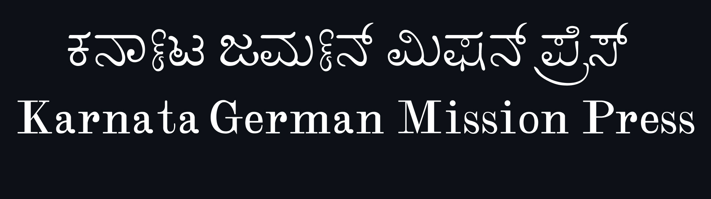
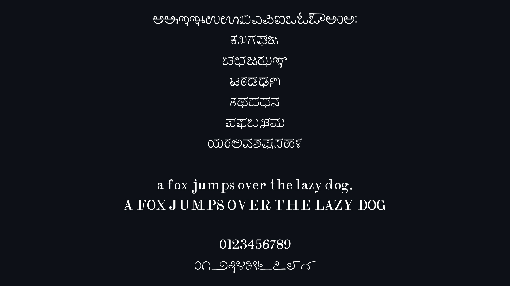
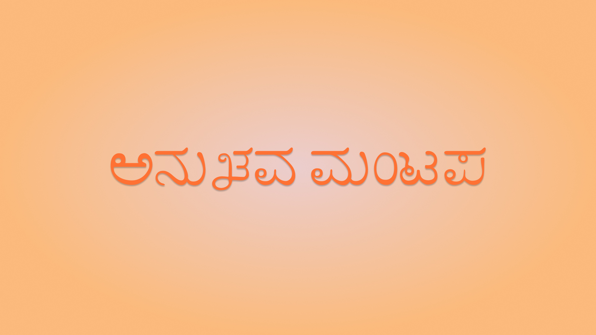

# ಕರ್ನಾಟ ಜರ್ಮನ್ ಮಿಷನ್ ಪ್ರೆಸ್ / Karnata German Mission Press Typeface

ಜರ್ಮನ್ ಮಿಷನ್ ಪ್ರೆಸ್ ಮುದ್ರಣಗಳಲ್ಲಿ ಕಾಣುವ ಕನ್ನಡ ಅಕ್ಷರಶೈಲಿಯ ಡಿಜಿಟಲ್ ಪುನರುತ್ಥಾನ.

Digital revival of a historical Kannada typeface from German Mission Press prints.

---

## ಪ್ರಕ್ರಿಯೆ / Process

### ಮೂಲ / Source
- ಮಂಗಳೂರು / ಬೆಂಗಳೂರು / ಮೈಸೂರು ಪ್ರದೇಶದ ಹಳೆಯ ಮುದ್ರಿತ ಪುಸ್ತಕಗಳಿಂದ ಉತ್ತಮ ಗುಣಮಟ್ಟದ ಸ್ಕ್ಯಾನ್‌ಗಳು
- ಮೂಲ ಶಾಯಿ ಮುದ್ರೆಗಳ ನೈಜತೆಯನ್ನು ಉಳಿಸುವ ಮೇಲೆ ಗಮನ

- High-quality scans from old printed books (Mangalore / Bangalore / Mysore region)
- Focus on authentic ink impressions and original letterforms

### ಡಿಜಿಟಲೀಕರಣ / Digitisation
- ಸ್ಕ್ಯಾನ್‌ಗಳನ್ನು ಕಪ್ಪು-ಬಿಳಿ ರೂಪಕ್ಕೆ ಪರಿವರ್ತನೆ
- ಕಾಗದ ಮತ್ತು ಶಾಯಿಯನ್ನು ಬೇರ್ಪಡಿಸಲಾಗಿದೆ
- ಸ್ವಚ್ಛ SVG outline‌ಗಳು ಸೃಷ್ಟಿಸಲಾಗಿದೆ

- Converted scans to black & white
- Separated ink from paper
- Generated clean SVG outlines

### ಗ್ಲಿಫ್ ಹೊರತೆಗೆಯುವಿಕೆ / Glyph Extraction
- ಕೈಯಾರೆ ಗ್ಲಿಫ್‌ಗಳನ್ನು ಪ್ರತ್ಯೇಕಿಸಲಾಗಿದೆ
- ಶಾಯಿ ಆಕಾರಗಳನ್ನು ಮಾತ್ರ ಉಳಿಸಲಾಗಿದೆ (noise ತೆಗೆದುಹಾಕಲಾಗಿದೆ)

- Manually isolated glyphs
- Retained only inked shapes (removed noise)

### ಅಭಿವೃದ್ಧಿ / Development
- FontLab‌ಗೆ ಗ್ಲಿಫ್‌ಗಳನ್ನು ಇಂಪೋರ್ಟ್ ಮಾಡಲಾಗಿದೆ
- ಯೂನಿಕೋಡ್‌ಗೆ ಮ್ಯಾಪ್ ಮಾಡಲಾಗಿದೆ (ಮೊದಲು ಕನ್ನಡ)
- ಕನಿಷ್ಠ ತಿದ್ದುಪಡಿ ಮೂಲಕ ಆಕಾರಗಳನ್ನು ಸಂಸ್ಕರಿಸಲಾಗಿದೆ

- Imported into FontLab
- Mapped to Unicode (Kannada first)
- Refined shapes with minimal corrections

### ಲ್ಯಾಟಿನ್ ಬೆಂಬಲ / Latin Support
- ಅದೇ ಮೂಲ ಶೈಲಿಯಿಂದ ಲ್ಯಾಟಿನ್ ಸೇರಿಸಲಾಗಿದೆ
- ಶೈಲೀಯ ಸಮ್ಮತತೆ ಕಾಯ್ದುಕೊಳ್ಳಲಾಗಿದೆ

- Added Latin from the same source
- Ensured stylistic consistency

### ವಿನ್ಯಾಸ ವಿಧಾನ / Design Approach
- ಮೂಲ ರಚನೆ ಮತ್ತು ಅನುಪಾತಗಳನ್ನು ಉಳಿಸಲಾಗಿದೆ
- ಸ್ಪಷ್ಟತೆಗೆ ಮಾತ್ರ ಕನಿಷ್ಠ ಹಸ್ತಕ್ಷೇಪ

- Preserved structure and proportions
- Minimal intervention for clarity

### ಎಂಜಿನಿಯರಿಂಗ್ / Engineering
- ಯೂನಿಕೋಡ್‌ಗೆ ಅನುಗುಣವಾದ ರಚನೆ
- ಕನ್ನಡ OpenType shaping ಬೆಂಬಲ
- spacing ಮತ್ತು metrics ಸರಿಪಡಿಸಲಾಗಿದೆ

- Unicode-compliant structure
- OpenType support for Kannada shaping
- Spacing and metrics adjusted

---

## ಔಟ್‌ಪುಟ್ / Output

- ಏಕ ತೂಕದ ಫಾಂಟ್
- ಪುಸ್ತಕ ಮುದ್ರಣಕ್ಕಾಗಿ ಸೂಕ್ತ
- OTF ರೂಪದಲ್ಲಿ ಎಕ್ಸ್ಪೋರ್ಟ್ ಮಾಡಲಾಗಿದೆ

- Single weight font  
- Optimised for book typesetting  
- Exported as OTF

---

## Contributors

Arun C Kallappanavar  
Vaishnavi Murthy  
Omshivaprakash H L  
Abhaya Simha  

---

## License

This project is released under an open font license.  
Free to use, modify, and distribute with proper attribution.
